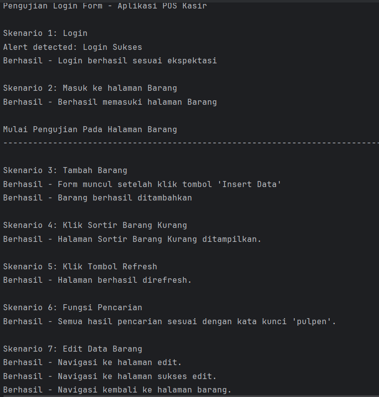
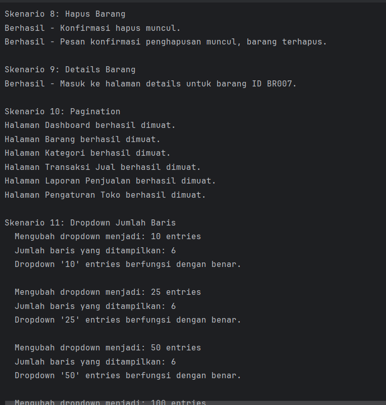
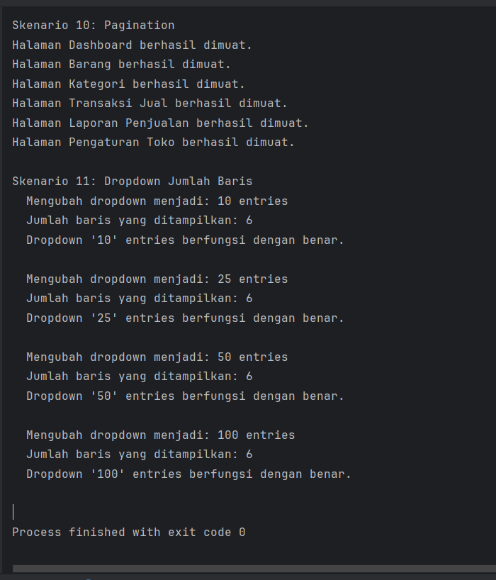

# TIM NAME

<body>
    <table border="1">
        <tr>
            <th>Nama</th>
            <th>NIM</th>
            <th>Kelas</th>
        </tr>
        <tr>
            <td>Ahmad Syukron</td>
            <td>312110056</td>
            <td>TI.21.A.SE.1</td>
        </tr>
        <tr>
            <td>Abid Husein</td>
            <td>312110031</td>
            <td>TI.21.A.SE.1</td>
        </tr>
        <tr>
            <td>Iman Setiawan</td>
            <td>312110219</td>
            <td>TI.21.A.SE.1</td>
        </tr>
        <tr>
            <td>Delfian Ruly Havatilla</td>
            <td>312110161</td>
            <td>TI.21.A.SE.1</td>
        </tr>
        <tr>
        </tr>
    </table>
</body>

## Video Proses Pengujian

## Hasil Pengujian

# TERIMAKASIH
Itu saja dari penjelasan kami.
